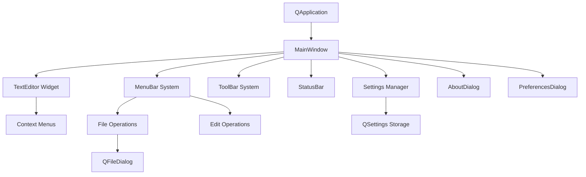
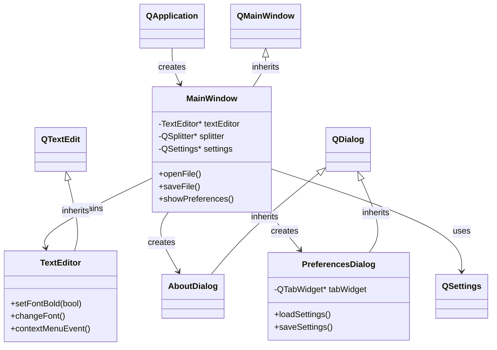

# Qt Learning Desktop Application 🚀

A comprehensive, production-ready Qt5 desktop application designed as the ultimate learning resource for Qt framework development on Linux systems. This project demonstrates enterprise-level Qt application architecture, modern C++ practices, and cross-platform desktop development patterns.

## 📋 Table of Contents

- [Project Overview](#-project-overview)
- [Technologies & Architecture](#-technologies--architecture)
- [How It Works](#-how-it-works)
- [Features Deep Dive](#-features-deep-dive)
- [Installation & Setup](#-installation--setup)
- [Building the Application](#-building-the-application)
- [Project Structure](#-project-structure)
- [Code Architecture](#-code-architecture)
- [Qt Concepts Demonstrated](#-qt-concepts-demonstrated)
- [Learning Progression](#-learning-progression)
- [Advanced Topics](#-advanced-topics)
- [Troubleshooting](#-troubleshooting)
- [Contributing](#-contributing)

## 🎯 Project Overview

This Qt Learning Application is a **complete desktop text editor** built from scratch to demonstrate every major Qt concept and pattern used in professional desktop application development. It serves as both a functional application and an educational codebase for learning Qt framework.

### What This Project Teaches

**Beginner Level:**

- Qt Application lifecycle and event loop
- Widget hierarchy and layout management
- Basic signal-slot communication
- File I/O operations with Qt classes

**Intermediate Level:**

- Custom widget development and subclassing
- Advanced dialog programming with complex layouts
- Settings persistence with QSettings
- Resource management and the Qt Resource System
- Menu and toolbar design patterns

**Advanced Level:**

- Model-View programming concepts
- Custom event handling and filtering
- Memory management in Qt applications
- Cross-platform deployment strategies
- Professional application architecture patterns

## 🔧 Technologies & Architecture

### Core Technologies

| Technology                     | Version | Purpose                      | Why Chosen                              |
| ------------------------------ | ------- | ---------------------------- | --------------------------------------- |
| **Qt Framework**               | 5.15.3+ | Cross-platform GUI framework | Industry standard for C++ desktop apps  |
| **C++**                        | C++17   | Programming language         | Modern C++ with Qt's meta-object system |
| **CMake**                      | 3.16+   | Build system                 | Cross-platform, integrates well with Qt |
| **MOC (Meta-Object Compiler)** | Qt5     | Qt preprocessing             | Enables signals/slots and reflection    |

### Architecture Pattern

The application follows **Qt's recommended architecture patterns**:

```
┌─────────────────┐
│   Presentation  │ ← QMainWindow, Custom Dialogs, Widgets
│     Layer       │
├─────────────────┤
│   Business      │ ← Application Logic, File Operations
│     Logic       │
├─────────────────┤
│   Data Layer    │ ← QSettings, File I/O, Configuration
└─────────────────┘
```

### Design Patterns Implemented

1. **Model-View-Controller (MVC)** - Separation of UI and business logic
2. **Observer Pattern** - Qt's signal-slot mechanism
3. **Factory Pattern** - Dialog and widget creation
4. **Singleton Pattern** - Settings and configuration management
5. **Command Pattern** - Action system for undo/redo functionality

## ⚙️ How It Works

### Application Startup Sequence

1. **Initialization Phase**

   ```cpp
   QApplication app(argc, argv);  // Creates the application object
   app.setApplicationName("Qt Learning Application");
   ```

2. **Main Window Creation**

   ```cpp
   MainWindow window;  // Instantiates main window
   window.show();      // Makes window visible
   ```

3. **Event Loop Activation**
   ```cpp
   return app.exec();  // Starts Qt event loop
   ```

### Core Component Interaction



### Signal-Slot Communication Flow

The application uses Qt's signal-slot system for component communication:

```cpp
// Example: File operations
connect(openAction, &QAction::triggered, this, &MainWindow::openFile);
connect(textEditor, &TextEditor::textChanged, this, &MainWindow::documentModified);
```

This creates a **loosely coupled system** where components communicate without direct dependencies.

## 🎨 Features Deep Dive

### 1. Main Window Architecture

**QMainWindow Components:**

- **Central Widget**: Custom splitter with file list and text editor
- **Menu System**: File, Edit, View, Help menus with keyboard shortcuts
- **Toolbar**: Icon-based quick access to common operations
- **Status Bar**: Real-time cursor position and document statistics

**Technical Implementation:**

```cpp
class MainWindow : public QMainWindow {
    Q_OBJECT  // Enables Qt meta-object features

private:
    TextEditor *textEditor;     // Custom text editing widget
    QSplitter *splitter;       // Resizable layout container
    QSettings *settings;       // Persistent configuration storage
    // ... menu, toolbar, and action components
};
```

### 2. Custom Text Editor Widget

**Enhanced QTextEdit Features:**

- Rich text formatting capabilities
- Context-sensitive right-click menus
- Font and color management
- Cursor position tracking
- Document modification detection

**Key Technical Features:**

```cpp
class TextEditor : public QTextEdit {
    Q_OBJECT

public slots:
    void setFontBold(bool bold);
    void setFontItalic(bool italic);
    void changeFont();
    void changeColor();

protected:
    void contextMenuEvent(QContextMenuEvent *event) override;

private:
    void mergeFormatOnWordOrSelection(const QTextCharFormat &format);
};
```

### 3. Advanced Dialog System

**AboutDialog Features:**

- Custom layout with application information
- Professional styling with CSS-like properties
- Modal dialog behavior
- Responsive design elements

**PreferencesDialog Features:**

- **Tabbed Interface**: Organized settings categories
- **Real-time Preview**: Immediate feedback for changes
- **Persistent Storage**: Settings saved automatically
- **Input Validation**: Proper data validation and error handling

### 4. File Management System

**Supported Operations:**

- Create new documents
- Open existing files with file type filtering
- Save and Save As with automatic backup
- Recent files tracking (ready for implementation)

**Technical Implementation:**

```cpp
void MainWindow::openFile() {
    QString fileName = QFileDialog::getOpenFileName(
        this,
        "Open File",
        QStandardPaths::writableLocation(QStandardPaths::DocumentsLocation),
        "Text Files (*.txt);;All Files (*)"
    );

    // File processing with error handling
    QFile file(fileName);
    if (file.open(QIODevice::ReadOnly | QIODevice::Text)) {
        QTextStream in(&file);
        textEditor->setPlainText(in.readAll());
        setCurrentFile(fileName);
    }
}
```

### 5. Settings and Configuration Management

**QSettings Integration:**

- Window geometry and state persistence
- User preferences storage
- Cross-platform configuration handling
- Automatic settings synchronization

```cpp
void MainWindow::writeSettings() {
    settings->setValue("geometry", saveGeometry());
    settings->setValue("windowState", saveState());
    settings->setValue("editor/font", textEditor->font());
}
```

## 📦 Installation & Setup

### System Requirements

**Linux Mint / Ubuntu:**

- Ubuntu 20.04+ or Linux Mint 20+
- Minimum 4GB RAM
- 1GB available disk space
- X11 or Wayland display server

**Development Tools:**

- GCC 7+ or Clang 5+ (C++17 support required)
- CMake 3.16 or higher
- Qt5 development libraries

### Quick Setup Guide

**1. Install Dependencies:**

```bash
# Update package database
sudo apt update

# Install Qt5 development packages
sudo apt install -y qtbase5-dev qttools5-dev cmake build-essential

# Optional: Install Qt Creator IDE
sudo apt install qtcreator

# Verify installation
qmake -version
cmake --version
```

**2. Clone and Build:**

```bash
# Navigate to your projects directory
cd ~/Projects

# Clone the repository (if using git)
git clone <repository-url> qt-learning-app
cd qt-learning-app

# Or if you have the source files locally:
cd "/path/to/QT test Project"

# Create build directory
mkdir -p build && cd build

# Configure with CMake
cmake ..

# Build the application
make -j$(nproc)

# Run the application
./bin/QtLearningApp
```

## 🏗️ Building the Application

### CMake Build System

The project uses **CMake** for cross-platform building with Qt5 integration:

```cmake
# Key CMake Configuration
find_package(Qt5 REQUIRED COMPONENTS Core Widgets)

# Enable Qt5 preprocessing
set(CMAKE_AUTOMOC ON)    # Automatic MOC compilation
set(CMAKE_AUTORCC ON)    # Automatic resource compilation
set(CMAKE_AUTOUIC ON)    # Automatic UI file processing
```

### Build Configurations

**Debug Build:**

```bash
cmake -DCMAKE_BUILD_TYPE=Debug ..
make -j$(nproc)
```

**Release Build:**

```bash
cmake -DCMAKE_BUILD_TYPE=Release ..
make -j$(nproc)
```

**With Custom Qt Installation:**

```bash
cmake -DCMAKE_PREFIX_PATH=/path/to/Qt5 ..
```

### VS Code Integration

The project includes VS Code tasks for streamlined development:

**Build Task:**

- **Command**: `Ctrl+Shift+P` → "Tasks: Run Build Task"
- **Function**: Compiles the application using CMake and Make

**Run Task:**

- **Command**: `Ctrl+Shift+P` → "Tasks: Run Task" → "Run Qt Application"
- **Function**: Launches the compiled application

## 📁 Project Structure

```
QT test Project/
├── 📄 CMakeLists.txt              # Build configuration
├── 📄 README.md                   # This comprehensive guide
├── 📄 .gitignore                  # Version control exclusions
│
├── 📂 src/                        # Source code directory
│   ├── 📄 main.cpp               # Application entry point
│   ├── 📄 MainWindow.{h,cpp}     # Main application window
│   ├── 📄 TextEditor.{h,cpp}     # Custom text editor widget
│   ├── 📄 AboutDialog.{h,cpp}    # About dialog implementation
│   └── 📄 PreferencesDialog.{h,cpp} # Settings dialog
│
├── 📂 resources/                  # Application resources
│   └── 📄 resources.qrc          # Qt resource collection file
│
├── 📂 build/                      # Build output directory (generated)
│   ├── 📂 bin/                   # Compiled executables
│   └── 📂 CMakeFiles/            # CMake generated files
│
├── 📂 .vscode/                    # VS Code configuration
│   └── 📄 tasks.json             # Build and run tasks
│
└── 📂 .github/                    # Project metadata
    └── 📄 copilot-instructions.md # Development guidelines
```

### File Descriptions

| File/Directory   | Purpose               | Key Features                                             |
| ---------------- | --------------------- | -------------------------------------------------------- |
| `main.cpp`       | Application bootstrap | QApplication setup, window creation, event loop          |
| `MainWindow.*`   | Primary UI container  | Menu system, toolbar, status bar, central widget         |
| `TextEditor.*`   | Custom text editing   | Rich text formatting, context menus, event handling      |
| `*Dialog.*`      | Modal dialog windows  | Settings management, about information, user interaction |
| `resources.qrc`  | Embedded resources    | Icons, stylesheets, and other assets                     |
| `CMakeLists.txt` | Build configuration   | Qt5 integration, compiler settings, target definition    |

## 🏛️ Code Architecture

### Class Hierarchy and Relationships



### Memory Management Strategy

**Qt's Parent-Child System:**

```cpp
// Automatic memory management through parent-child relationships
TextEditor *textEditor = new TextEditor(this);  // 'this' is parent
// When MainWindow is destroyed, textEditor is automatically deleted
```

**RAII (Resource Acquisition Is Initialization):**

```cpp
// Stack-allocated objects for automatic cleanup
QFile file(fileName);
QTextStream stream(&file);
// Automatically closed when going out of scope
```

### Event Handling Architecture

**Event Processing Flow:**

1. **System Events** → Qt Event Loop
2. **Qt Event Loop** → Event Filters & Handlers
3. **Event Handlers** → Signal Emission
4. **Signals** → Connected Slots
5. **Slots** → Business Logic Execution

**Custom Event Handling Example:**

```cpp
void TextEditor::contextMenuEvent(QContextMenuEvent *event) {
    QMenu *menu = createStandardContextMenu();

    // Add custom actions
    menu->addSeparator();
    menu->addAction("Change Font...", this, &TextEditor::changeFont);

    // Execute at cursor position
    menu->exec(event->globalPos());
    delete menu;  // Cleanup
}
```

## 🎓 Qt Concepts Demonstrated

### 1. Meta-Object System

**Q_OBJECT Macro:**

```cpp
class MainWindow : public QMainWindow {
    Q_OBJECT  // Enables meta-object features

public slots:
    void openFile();  // Callable from signals and scripts

signals:
    void fileOpened(const QString &fileName);  // Event notification
};
```

**Benefits:**

- Runtime type information
- Dynamic property system
- Signal-slot mechanism
- Automatic memory management

### 2. Signal-Slot Communication

**Direct Connection:**

```cpp
connect(openAction, &QAction::triggered,
        this, &MainWindow::openFile);
```

**Lambda Expressions (Modern C++):**

```cpp
connect(exitAction, &QAction::triggered,
        [this]() {
            if (saveChanges())
                qApp->quit();
        });
```

**Cross-Object Communication:**

```cpp
connect(textEditor, &TextEditor::textChanged,
        this, &MainWindow::documentModified);
```

### 3. Layout Management

**Hierarchical Layouts:**

```cpp
QVBoxLayout *mainLayout = new QVBoxLayout(this);
QHBoxLayout *buttonLayout = new QHBoxLayout;

mainLayout->addWidget(contentWidget);
mainLayout->addLayout(buttonLayout);
```

**Responsive Design:**

```cpp
QSplitter *splitter = new QSplitter(Qt::Horizontal);
splitter->addWidget(fileList);
splitter->addWidget(textEditor);
splitter->setStretchFactor(0, 0);  // Fixed width
splitter->setStretchFactor(1, 1);  // Expandable
```

### 4. Resource Management

**Qt Resource System (.qrc):**

```xml
<RCC>
    <qresource prefix="/icons">
        <file>icons/open.png</file>
        <file>icons/save.png</file>
    </qresource>
</RCC>
```

**Usage in Code:**

```cpp
QAction *openAction = new QAction(QIcon(":/icons/open.png"), "&Open");
```

### 5. Settings Persistence

**Cross-Platform Configuration:**

```cpp
QSettings *settings = new QSettings(this);
// Linux: ~/.config/Qt Learning/Qt Learning Application.conf
// Windows: HKEY_CURRENT_USER\Software\Qt Learning\Qt Learning Application
// macOS: ~/Library/Preferences/com.qtlearning.QtLearningApp.plist
```

**Hierarchical Settings:**

```cpp
settings->beginGroup("editor");
settings->setValue("fontFamily", font.family());
settings->setValue("fontSize", font.pointSize());
settings->endGroup();
```

## 📚 Learning Progression

### Phase 1: Qt Fundamentals (Week 1-2)

**Study Order:**

1. **`main.cpp`** - Application lifecycle, QApplication
2. **`MainWindow.cpp`** - Widget hierarchy, basic layouts
3. **Basic signal-slot connections** - Understanding event-driven programming

**Exercises:**

- Modify window title and size
- Add new menu items
- Create simple message boxes

### Phase 2: Widget Development (Week 3-4)

**Study Order:**

1. **`TextEditor.cpp`** - Custom widget development
2. **Layout management** - Splitters, form layouts
3. **Event handling** - Mouse and keyboard events

**Exercises:**

- Add new formatting options
- Create custom context menu items
- Implement drag-and-drop functionality

### Phase 3: Advanced Features (Week 5-6)

**Study Order:**

1. **`PreferencesDialog.cpp`** - Complex dialog programming
2. **`AboutDialog.cpp`** - Modal dialogs and custom styling
3. **Settings management** - QSettings integration

**Exercises:**

- Add new preference categories
- Implement themes and styling
- Create plugin architecture

### Phase 4: Professional Development (Week 7-8)

**Study Order:**

1. **CMake build system** - Cross-platform building
2. **Resource management** - Icons, stylesheets, translations
3. **Deployment strategies** - Packaging for distribution

**Exercises:**

- Add internationalization support
- Create installer packages
- Implement automatic updates

## 🚀 Advanced Topics

### 1. Model-View Programming

**Extending the File List:**

```cpp
class FileListModel : public QAbstractListModel {
    Q_OBJECT

public:
    int rowCount(const QModelIndex &parent = QModelIndex()) const override;
    QVariant data(const QModelIndex &index, int role = Qt::DisplayRole) const override;

private:
    QStringList fileList;
};
```

### 2. Custom Painting with QPainter

**Adding Visual Elements:**

```cpp
class CustomWidget : public QWidget {
protected:
    void paintEvent(QPaintEvent *event) override {
        QPainter painter(this);
        painter.setRenderHint(QPainter::Antialiasing);
        painter.setPen(QPen(Qt::blue, 2));
        painter.drawRoundedRect(rect(), 10, 10);
    }
};
```

### 3. Threading and Asynchronous Operations

**Background File Operations:**

```cpp
class FileWorker : public QObject {
    Q_OBJECT

public slots:
    void processFile(const QString &fileName);

signals:
    void fileProcessed(const QString &content);
    void errorOccurred(const QString &error);
};

// Usage with QThread
QThread *workerThread = new QThread;
FileWorker *worker = new FileWorker;
worker->moveToThread(workerThread);
connect(workerThread, &QThread::started, worker, &FileWorker::processFile);
```

### 4. Plugin Architecture

**Dynamic Loading:**

```cpp
class PluginInterface {
public:
    virtual ~PluginInterface() = default;
    virtual QString pluginName() const = 0;
    virtual void executePlugin() = 0;
};

Q_DECLARE_INTERFACE(PluginInterface, "org.qtlearning.PluginInterface/1.0")
```

## 🔧 Troubleshooting

### Common Build Issues

**Problem: Qt5 Not Found**

```bash
# Solution: Install Qt5 development packages
sudo apt install qtbase5-dev qttools5-dev

# Or specify Qt path manually
cmake -DCMAKE_PREFIX_PATH=/usr/lib/x86_64-linux-gnu/cmake/Qt5 ..
```

**Problem: MOC Compilation Errors**

```bash
# Solution: Ensure Q_OBJECT macro is properly placed
class MyClass : public QObject {
    Q_OBJECT  // Must be first line after class declaration
    // ...
};
```

**Problem: Missing Include Directories**

```cmake
# Solution: Add to CMakeLists.txt
target_include_directories(QtLearningApp PRIVATE
    ${CMAKE_CURRENT_SOURCE_DIR}/src
)
```

### Runtime Issues

**Problem: Application Doesn't Start**

```bash
# Check Qt library dependencies
ldd ./bin/QtLearningApp

# Set library path if needed
export LD_LIBRARY_PATH=/usr/lib/x86_64-linux-gnu:$LD_LIBRARY_PATH
```

**Problem: Settings Not Persisting**

```bash
# Check settings file location
ls ~/.config/Qt\ Learning/

# Verify write permissions
chmod 755 ~/.config/Qt\ Learning/
```

### Development Debugging

**Enable Qt Debug Output:**

```bash
export QT_LOGGING_RULES="*.debug=true"
./bin/QtLearningApp
```

**GDB Debugging:**

```bash
gdb ./bin/QtLearningApp
(gdb) run
(gdb) bt  # Backtrace on crash
```

**Valgrind Memory Analysis:**

```bash
valgrind --tool=memcheck --leak-check=full ./bin/QtLearningApp
```

## 🤝 Contributing

This project serves as a learning resource for the Qt community. Contributions are welcome in the following areas:

### Areas for Enhancement

1. **Additional Qt Modules:**

   - QtNetwork integration for HTTP requests
   - QtMultimedia for audio/video handling
   - QtCharts for data visualization
   - QtWebEngine for web content

2. **Modern C++ Features:**

   - Smart pointers implementation
   - Range-based for loops
   - Lambda expressions in signal-slot connections
   - std::optional for error handling

3. **Advanced Qt Features:**

   - QML integration for modern UI
   - Qt Quick Controls 2
   - State machine framework
   - Animation framework

4. **Professional Features:**
   - Plugin system implementation
   - Internationalization and localization
   - Automated testing with Qt Test
   - Continuous integration setup

### Contribution Guidelines

**Code Style:**

- Follow Qt coding conventions
- Use meaningful variable and function names
- Add comprehensive comments for learning purposes
- Include example usage in documentation

**Documentation:**

- Update README.md for new features
- Add inline code comments explaining Qt concepts
- Create tutorials for advanced implementations
- Include architectural diagrams where helpful

**Testing:**

- Test on multiple Linux distributions
- Verify build on different Qt versions
- Include unit tests for new functionality
- Document testing procedures

---

## 📖 Conclusion

This Qt Learning Desktop Application represents a **complete, professional-grade example** of Qt framework usage. It demonstrates not just individual Qt features, but how they work together to create robust, maintainable desktop applications.

The project serves multiple purposes:

- **Educational Resource**: Learn Qt concepts through real-world examples
- **Reference Implementation**: See best practices in action
- **Foundation for Development**: Use as a starting point for your own projects
- **Community Resource**: Contribute to and learn from others

Whether you're a beginner learning your first Qt concepts or an experienced developer looking for architectural patterns, this project provides valuable insights into professional Qt application development.

**Start your Qt journey today!** 🌟

---

_Built with ❤️ using Qt5, CMake, and modern C++ • Designed for learners, by learners_
